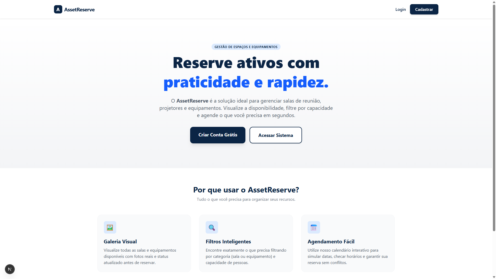
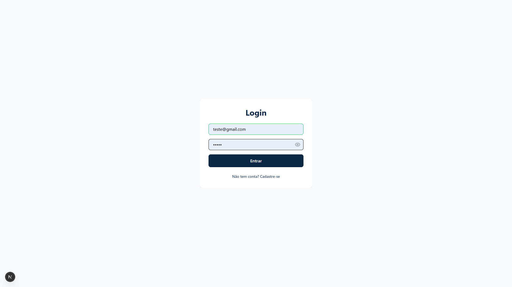
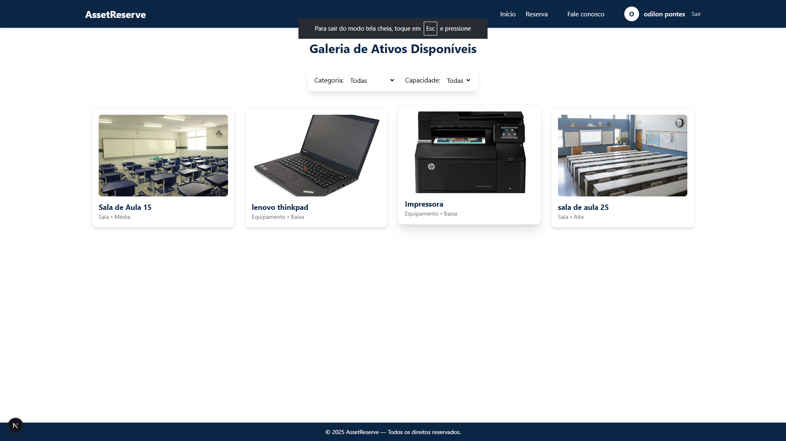
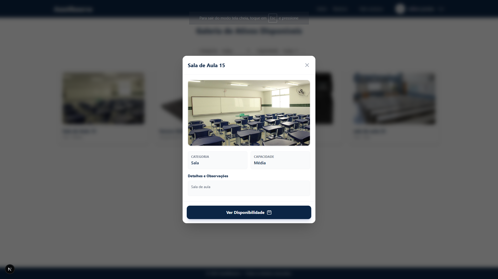
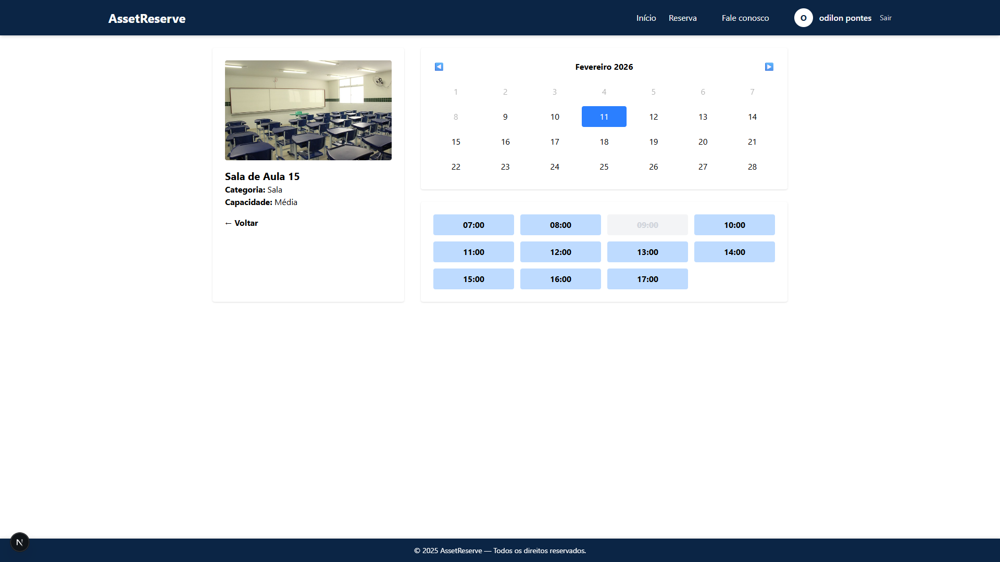
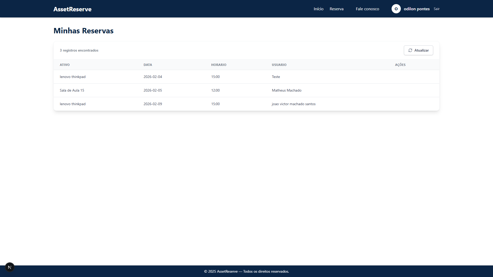
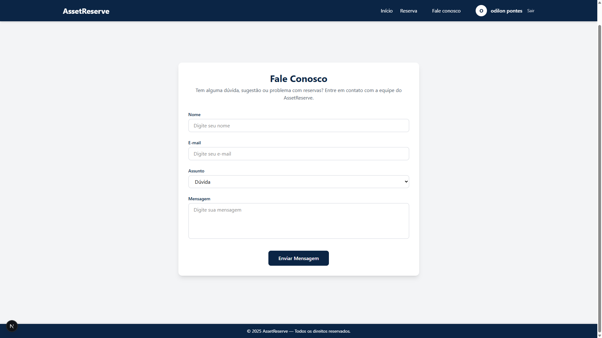

# 🚀 AssetReserve — Sistema de Reserva de Ativos

O **AssetReserve** é uma aplicação web para gerenciamento e reserva de ativos (salas e equipamentos), desenvolvida para as disciplinas **PW2 (Programação Web 2)** e **Engenharia de Requisitos**.

O sistema permite que usuários visualizem ativos disponíveis, consultem detalhes, escolham datas e realizem reservas por meio de uma interface moderna, responsiva e interativa.

---

## 🖼️ Screenshots do Sistema

















---

## ✨ Funcionalidades

- 📋 Galeria de ativos com imagens e status em tempo real
- 🔎 Filtro dinâmico por categoria e capacidade
- 🗓️ Seleção de data para agendamento
- 🧾 Modal com detalhes completos do ativo
- 🔐 Autenticação de usuários com Supabase Auth
- 💾 Persistência real de dados com Supabase Database
- 📱 Layout totalmente responsivo (desktop, tablet e mobile)

---

## 🛠️ Tecnologias Utilizadas

| Tecnologia | Função no Projeto |
|------------|-------------------|
| **Next.js** | Framework React com SSR, rotas automáticas e performance otimizada |
| **React** | Componentização e renderização da interface |
| **CSS3** | Estilização com Flexbox, Grid e Media Queries |
| **JavaScript** | Interatividade da aplicação |
| **Supabase** | Backend as a Service (Banco de Dados + Autenticação) |
| **Bootstrap** | Sistema de grid e componentes responsivos |

---

## 🗂️ Estrutura do Projeto


```
AssetReserve/
├── public/ # Imagens e arquivos estáticos
├── src/
│ ├── components/ # Componentes reutilizáveis
│ ├── pages/ # Páginas da aplicação (rotas)
│ ├── services/ # Comunicação com o Supabase
│ ├── styles/ # Arquivos CSS
│ └── lib/ # Configuração do Supabase
├── package.json
└── README.md              # Este arquivo
```

---

## ⚙️ Instalação e Execução

### 🧩 Pré-requisitos

- Node.js 16+
- NPM ou Yarn

---

### 🚀 Passos

1️⃣ Clone o repositório

```bash
git clone https://github.com/odilon007/Projeto-PW2.git
```

2. **Acesse o diretório do projeto**
    ```bash
    cd Projeto-PW2

3. **Instale as dependências**
    ```bash
    npm i

4. **Configure as variáveis de ambiente**
   Crie um arquivo .env.local na raiz do projeto:
   ```
   NEXT_PUBLIC_SUPABASE_URL=...
   NEXT_PUBLIC_SUPABASE_ANON_KEY=...
   ```

5. **Inicie o servidor de desenvolvimento**
    ```bash
    npm run dev

6. **A aplicação estara disponivel em:**
   ```
   http://localhost:3000

   ```

## 🔮 Melhorias Futuras

- 📊 Painel administrativo para gerenciamento de ativos

- 📧 Notificações de reservas por e-mail

- 📈 Histórico de reservas do usuário

- 🎨 Interface aprimorada com TailwindCSS

## 🤝Contribuindo

Contribuições são bem-vindas! 💡
Para contribuir:

1. **Faça um fork do repositório**
2. **Crie uma branch para sua feature**
    ```bash
    git checkout -b minha-feature

3. **Realize as alterações e envie**
    ```bash
    git push origin minha-feature

Depois, abra um Pull Request descrevendo suas modificações.

## 👨‍💻Equipe

[@odilon007](https://github.com/odilon007)

[@MatheusMachado16](https://github.com/MatheusMachado16)

[@omarhenriqu3](https://github.com/omarhenriqu3)

[@DaviPatricio06](https://github.com/DaviPatricio06)
